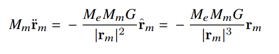
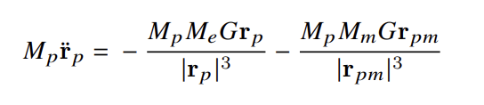
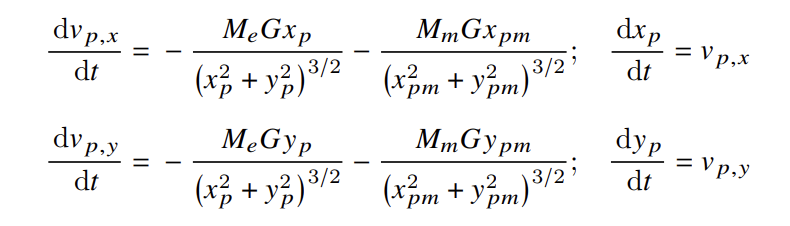
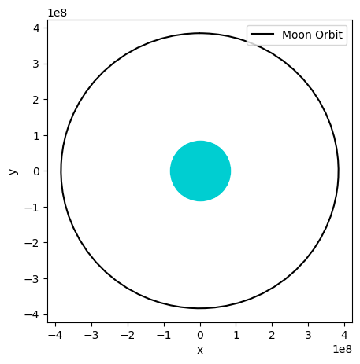
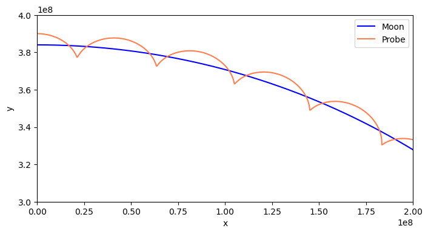

In this project, the orbit of the moon was computed using scipy.integrate. It was then extended to compute the orbit of a probe around the moon, from an Earth frame of reference. 

## Goals
- To use numerical approaches to explore the motion of satellites
- To learn more about the integration methods provided by scipy.integrate
- Applying differential equations to model a real world scenario

## Folders used
- scipy
- numpy
- matplotlib

## Equations considered
### Moon around the Earth

### Probe around the Moon

## Results
Two plots were produced, one representing the orbit of the moon around the Earth and the other displaying the orbits of both the moon and the probe around the Earth. Obtaining these plots involved determining the appropriate tolerances in the integration that would result in the most accurate plot. 

